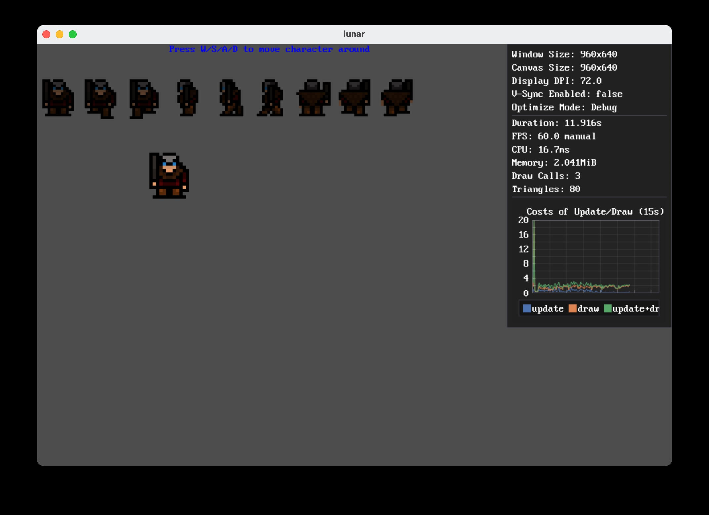

# lunar
Write games use [jok](https://github.com/Jack-Ji/jok)(zig) through MoonBit(wasm).

# How to run the game

Steps:
* Install [zig v0.14](https://ziglang.org/download/#release-0.14.0)
* Install SDL2
* Clone the project
* Fetch jok dependency
* Download wasmtime-c-api ([v30.0.2](https://github.com/bytecodealliance/wasmtime/releases/tag/v30.0.2))
* Build the game (moonbit)
* Run the game

``` sh
# ==== Install SDL2 ====
# Debian/Ubuntu
sudo apt install libsdl2-dev
# Fedora/CentOS
sudo yum install SDL2-devel
# MacOS
brew install sdl2

# ==== Clone the project ====
git clone git@github.com:TheWaWaR/lunar.git
cd lunar
# === Fetch jok dependency ====
zig fetch --save git+https://github.com/jack-ji/jok.git

# ==== Download wasmtime-c-api ====
# Macos (M1)
wget -P wasmtime https://github.com/bytecodealliance/wasmtime/releases/download/v30.0.2/wasmtime-v30.0.2-aarch64-macos-c-api.tar.xz
# Linux (x86_64)
wget -P wasmtime https://github.com/bytecodealliance/wasmtime/releases/download/v30.0.2/wasmtime-v30.0.2-x86_64-linux-c-api.tar.xz

cd wasmtime && tar -xf *.tar.xz && cd ..

# ==== Build the game ====
cd moonbit/examples/animation-2d/
moon build --target wasm
cd ../../..

# ==== Run the game ====
mkdir -p zig-out
cd zig-out && ln -s ../assets assets && cd ..
zig build run -- ./moonbit/examples/animation-2d/target/wasm/release/build/lunar.wasm
```

## Demo


# Potential future of this project
* Write entire game use moonbit
  - Release as wasm (since wasmtime JIT is [fast](https://programming-language-benchmarks.vercel.app/wasm-vs-lua))
  - Release as native dynamic library (since moonbit can compile to [native](https://www.moonbitlang.com/blog/native))
* Write game mod use moobit (since wasm is a performant and safe sandbox)
